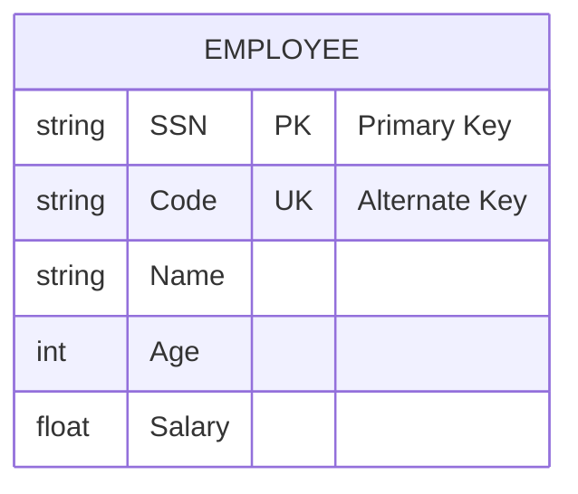
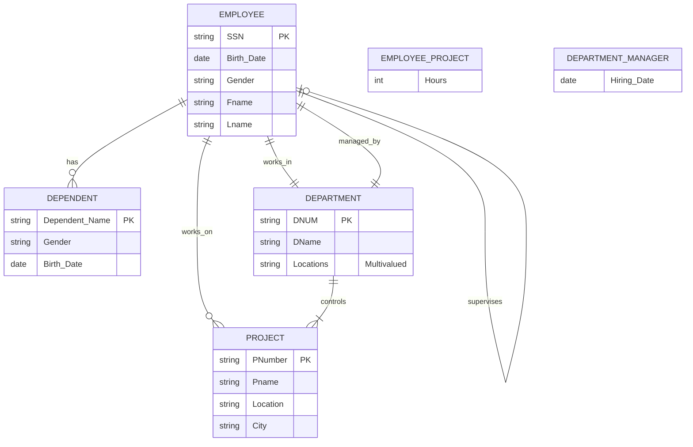

# Keys in Database Design

Keys play a crucial role in database design, ensuring data integrity, uniqueness, and efficient data retrieval. They address issues like data redundancy and help maintain the relationships between different entities in a database.

## Types of Keys

1. Candidate Key
2. Primary Key
3. Alternate Key
4. Foreign Key
5. Composite Key
6. Partial Key
7. Super Key
8. Compound Key

## Detailed Explanation

### 1. Candidate Key
- Definition: An attribute (or set of attributes) that can uniquely identify a record in a table.
- Characteristics:
  - Must be unique
  - Cannot be null
- Example: In an employee table, both SSN and employee code could be candidate keys.

### 2. Primary Key
- Definition: The chosen candidate key that is used to uniquely identify each record in a table.
- Characteristics:
  - Must be unique
  - Cannot be null
  - Only one per table
- Example: Employee SSN chosen as the primary key.

### 3. Alternate Key
- Definition: A candidate key that is not selected as the primary key.
- Example: If SSN is the primary key, the employee code becomes an alternate key.

### 4. Foreign Key
- Definition: An attribute in one table that refers to the primary key in another table.
- Used to establish relationships between tables.

### 5. Composite Key
- Definition: A key that consists of two or more attributes to uniquely identify a record.
- Used when a single attribute cannot ensure uniqueness.

### 6. Partial Key
- Definition: A key used in weak entities that requires additional attributes to uniquely identify records.
- Often combined with the primary key of the strong entity it's related to.

### 7. Super Key
- Definition: A set of one or more attributes that can uniquely identify a record in a table.
- Includes candidate keys and any of their supersets.

### 8. Compound Key
- Similar to a composite key, it's a key that consists of multiple attributes.
- Often used interchangeably with composite key.

## Example: Employee Entity

Consider an employee entity with the following attributes:
- Code
- SSN (Social Security Number)
- Name
- Age
- Salary

In this scenario:
- Both `Code` and `SSN` could serve as candidate keys.
- Let's say we choose `SSN` as the primary key.
- `Code` then becomes an alternate key.
- `Name`, `Age`, and `Salary` are non-key attributes.

## Importance of Keys

1. **Ensure Data Integrity**: Prevent duplicate records and maintain data consistency.
2. **Establish Relationships**: Foreign keys create connections between related tables.
3. **Improve Query Performance**: Indexing on key attributes speeds up data retrieval.
4. **Enforce Business Rules**: Keys can reflect and enforce important business constraints.

## Best Practices

1. Choose primary keys wisely, considering both current and future data scenarios.
2. Use surrogate keys (e.g., auto-incrementing integers) for better performance and flexibility.
3. Ensure that foreign keys have matching data types with the primary keys they reference.
4. Consider using composite keys when a single attribute cannot guarantee uniqueness.
5. Regularly review and maintain key structures as the database evolves.

# Steps for Creating E-R Diagram: Company Database Case Study

## 1. Entity Identification

- Read through the requirements once to identify all entities.
- Entities are typically nouns that represent distinct objects or concepts.

### Identified Entities:
1. Employee
2. Department
3. Project
4. Dependent

## 2. Attribute Assignment

- For each entity, identify its attributes.
- Pay attention to key attributes (underlined in the requirements).

## 3. Relationship Identification

- Read through the requirements a second time to identify relationships between entities.
- For each relationship, determine:
  a. Degree (Unary, Binary, Ternary)
  b. Cardinality (One-to-One, One-to-Many, Many-to-Many)
  c. Participation (Total or Partial)

## 4. Special Considerations

- Weak entities (e.g., Dependent) always have total participation in their identifying relationship.
- The relationship between a strong entity and its weak entity is an identifying relationship.

## 5. Notes from Requirements

- Employees can have multiple dependents, but dependents are removed if the employee leaves.
- Each department has exactly one manager (an employee) with a hiring date.
- Employees work in only one department, but departments can have multiple employees.
- Projects are assigned to one department, but departments can have multiple projects.
- Employees can work on multiple projects, and projects can have multiple employees.
- Working hours for each employee on each project need to be recorded.
- Each employee has a supervisor (another employee).

## 6. E-R Diagram Creation

- Draw entities as rectangles.
- Represent attributes as ovals connected to their entity.
- Show relationships as diamond shapes between entities.
- Use appropriate symbols for cardinality and participation.
- Represent weak entities with double rectangles.
- Use double diamonds for identifying relationships.

## 7. Review and Refine

- Ensure all requirements are captured in the diagram.
- Check for consistency and completeness.
- Validate that the diagram accurately represents the described system.

---

With these steps and notes in mind, we can proceed to create the E-R diagram for the company database case study.

## Conclusion

Understanding and properly implementing different types of keys is fundamental to good database design. Keys not only ensure data integrity and uniqueness but also play a vital role in establishing relationships between different entities in a database system. By carefully selecting and managing keys, database designers can create efficient, consistent, and reliable database structures.

# E-R Diagram: Company Database

## Entity Descriptions:

1. EMPLOYEE
   - Primary Key: SSN
   - Attributes: Birth_Date, Gender, Fname, Lname

2. DEPARTMENT
   - Primary Key: DNUM
   - Attributes: DName, Locations (multi-valued)

3. PROJECT
   - Primary Key: PNumber
   - Attributes: Pname, Location, City

4. DEPENDENT (Weak Entity)
   - Partial Key: Dependent_Name
   - Attributes: Gender, Birth_Date

## Relationship Descriptions:

1. EMPLOYEE - DEPENDENT
   - Cardinality: One-to-Many
   - Participation: Partial (Employee), Total (Dependent)
   - Note: Identifying relationship (double diamond in actual diagram)

2. EMPLOYEE - DEPARTMENT
   - Cardinality: Many-to-One
   - Participation: Total (Employee), Total (Department)

3. EMPLOYEE - PROJECT
   - Cardinality: Many-to-Many
   - Participation: Partial (both)
   - Attribute: Hours (on EMPLOYEE_PROJECT relationship)

4. DEPARTMENT - PROJECT
   - Cardinality: One-to-Many
   - Participation: Partial (Department), Total (Project)

5. EMPLOYEE - EMPLOYEE (Supervisor)
   - Cardinality: Many-to-One
   - Participation: Partial (both)

6. DEPARTMENT - EMPLOYEE (Manager)
   - Cardinality: One-to-One
   - Participation: Total (Department), Partial (Employee)
   - Attribute: Hiring_Date (on DEPARTMENT_MANAGER relationship)

## Notes:
- DEPENDENT is represented as a strong entity in the Mermaid diagram due to limitations, but it should be a weak entity in the actual E-R diagram.
- The 'Locations' attribute of DEPARTMENT is multi-valued but represented as a single attribute in Mermaid.
- Relationship attributes (Hours for EMPLOYEE-PROJECT, Hiring_Date for DEPARTMENT-EMPLOYEE manager) are represented as separate entities due to Mermaid limitations.
- In a graphical E-R diagram, use appropriate symbols for cardinality and participation (e.g., double lines for total participation).
